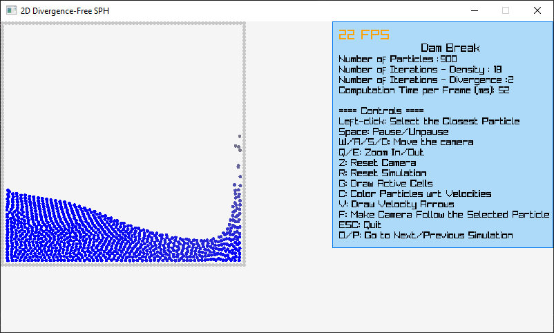

# Divergence-Free Smoothed Particle Hydrodynamics in C++

This is a C++ implementation of the "Divergence-Free SPH for Incompressible and Viscous Fluids" paper by Jan Bender and Dan Koschier (2017) along with the XSPH viscosity Hagit Schechter and Robert Bridson's "Ghost SPH for Animating Water" (2012) and the rigid-fluid coupling method of "Versatile rigid-fluid coupling for incompressible SPH" by Akinci et al. (2012). The modified equations for the constant density and the divergence solvers come from InteractiveComputerGraphics's website (https://interactivecomputergraphics.github.io/physics-simulation/examples/dfsph.html).

This implementation uses the raylib video game programming library (https://github.com/raysan5/raylib) along with raylib-cpp (https://github.com/RobLoach/raylib-cpp).
